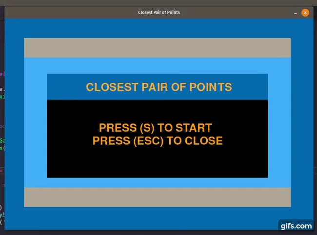

# <p align="center"> Closest Pair of Points using Divide and Conquer </p>

## Autors

| Name  | University Registration  | GitHub | Email |
|---|---|---|---|
| Daniel Maike Mendes Gonçalves  | 16/0117003  | [DanMke](https://github.com/DanMke) | danmke@hotmail.com |
| Lucas Pereira de Andrade Macêdo  | 15/0137397  | [lukassxp](https://github.com/lukassxp) | lpalucas.10@gmail.com |

## Installation

> * ``` git clone https://github.com/projeto-de-algoritmos/Divide-and-Conquer-List4-DanielGoncalves-LucasMacedo.git ``` <br> <br>
> * ``` pip3 install -r requirements.txt --user ```

## Execution

> * ```python3 closest_pair_points.py```

 <br>
